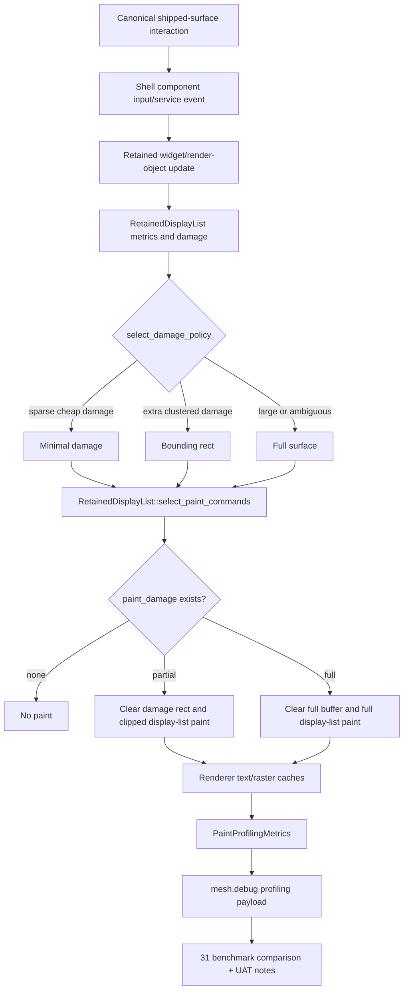

# Phase 31: Smoothness Proof and CPU Render Tuning - Research

**Researched:** 2026-05-12
**Domain:** MESH retained CPU rendering smoothness proof, repaint-policy tuning, raster-cache tuning, and shipped-surface validation
**Confidence:** HIGH

<user_constraints>
## User Constraints (from CONTEXT.md)

### Locked Decisions
## Implementation Decisions

### Smoothness Acceptance Proof
- **D-01:** Phase 31 acceptance uses mixed proof: canonical benchmark evidence plus focused manual UAT notes on shipped surfaces.
- **D-02:** Benchmark data is necessary but not sufficient; this phase exists to prove user-visible smoothness, not just improved internal counters.
- **D-03:** Manual UAT should stay focused on the canonical shipped-surface scenarios: `hover`, `surface_open_close`, `pointer_update`, `keyboard_traversal`, and `backend_update`.

### Tuning Posture
- **D-04:** Use a conservative tuning posture. Tune measured thresholds and heuristics only where existing proof shows a win.
- **D-05:** Avoid structural rewrites in Phase 31. The retained rendering architecture, damage filtering, and raster cache ownership established in Phases 27-30 are inputs to tune, not systems to redesign.
- **D-06:** Changes should be small enough to explain with before/after benchmark evidence and targeted tests.

### Correctness Guardrails
- **D-07:** Use strict correctness guardrails. Every tuning change needs tests or UAT notes showing visuals and interactions remain unchanged apart from smoother rendering.
- **D-08:** If a tuning change cannot prove visual and interaction correctness cheaply, prefer leaving it conservative and documenting it for future work.
- **D-09:** Repaint/cache threshold changes must preserve existing display-list ordering, clipping, scrollbar inclusion, overlay behavior, cache freshness, and opacity/translucency conservatism.

### the agent's Discretion
- Planner may choose the exact threshold values, benchmark comparison format, and UAT note structure, provided they honor D-01 through D-09.
- Planner may choose whether to implement one combined tuning plan or split tuning and proof into separate plans, provided all Phase 31 requirements are covered.

### Deferred Ideas (OUT OF SCOPE)
## Deferred Ideas

### Reviewed Todos (not folded)
- `2026-05-08-create-unified-package-and-module-manifest-phase.md` — matched by generic planning terms but unrelated to CPU smoothness tuning. Keep as separate backlog/future planning work.
</user_constraints>

<phase_requirements>
## Phase Requirements

| ID | Description | Research Support |
|----|-------------|------------------|
| PERF-03 | Optimization decisions are accepted only when they improve visible smoothness on shipped shell surfaces, not merely aggregate internal counters. | Use mixed benchmark plus UAT acceptance and require before/after scenario evidence for each threshold change. [VERIFIED: .planning/REQUIREMENTS.md] [VERIFIED: .planning/phases/31-smoothness-proof-and-cpu-render-tuning/31-CONTEXT.md] |
| SMTH-01 | Canonical hover, surface open/close, pointer update, keyboard traversal, and backend update scenarios look visibly smoother on shipped surfaces after the milestone. | Reuse the Phase 26/30 canonical real-surface proof command and add manual UAT notes for the same five scenarios. [VERIFIED: .planning/REQUIREMENTS.md] [VERIFIED: .planning/phases/26-cpu-render-profiling-and-baseline-proof/26-01-BASELINE.md] [VERIFIED: .planning/phases/30-raster-cache-hardening-for-icons-images-and-text/30-01-BENCHMARK.md] |
| SMTH-02 | Normal shell visuals and interaction correctness remain unchanged apart from smoother rendering behavior. | Preserve display-list order, clipping, scrollbar/tooltip behavior, cache freshness, and opacity conservatism; map each tuning edit to focused render/shell tests. [VERIFIED: .planning/REQUIREMENTS.md] [VERIFIED: crates/core/frontend/render/src/display_list.rs] [VERIFIED: crates/core/shell/src/shell/component/shell_component.rs] |
| SMTH-03 | GPU backend and parallel paint/layout remain out of scope until the CPU retained pipeline is demonstrably smooth on real surfaces. | Document future GPU/parallel boundaries after CPU proof; do not add GPU backend, parallel paint/layout, or a new benchmark system in this phase. [VERIFIED: .planning/REQUIREMENTS.md] [VERIFIED: .planning/ROADMAP.md] [VERIFIED: .planning/PROJECT.md] |
</phase_requirements>

## Summary

Phase 31 should plan a conservative tuning-and-proof pass over the CPU retained rendering pipeline, not a renderer redesign. [VERIFIED: .planning/phases/31-smoothness-proof-and-cpu-render-tuning/31-CONTEXT.md] The established seams are `select_damage_policy(...)` in shell orchestration, `RetainedDisplayList::select_paint_commands(...)` in `mesh-core-render`, the raster variant cache in `surface/icon.rs`, text layout cache metrics in `surface/text.rs`, and the shipped-surface profiling proof in `component/tests/invalidation/profiling.rs`. [VERIFIED: crates/core/shell/src/shell/component/shell_component.rs] [VERIFIED: crates/core/frontend/render/src/display_list.rs] [VERIFIED: crates/core/frontend/render/src/surface/icon.rs] [VERIFIED: crates/core/frontend/render/src/surface/text.rs] [VERIFIED: crates/core/shell/src/shell/component/tests/invalidation/profiling.rs]

The planner should require every tuning change to produce two kinds of evidence: a targeted automated guardrail proving visual/interaction invariants, and a canonical scenario comparison against Phase 26 baseline plus Phase 30 cache proof. [VERIFIED: .planning/phases/26-cpu-render-profiling-and-baseline-proof/26-01-BASELINE.md] [VERIFIED: .planning/phases/30-raster-cache-hardening-for-icons-images-and-text/30-01-BENCHMARK.md] Qt guidance supports the same posture: profile first, retain work across frames, avoid CPU-side cleverness that costs more than it saves, treat clipping and blending as performance-sensitive, and keep frame work under tight timing budgets. [CITED: https://doc.qt.io/qt-6/qtquick-performance.html] [CITED: https://doc.qt.io/qt-6/qtquick-visualcanvas-scenegraph-renderer.html]

**Primary recommendation:** Plan one focused tuning/proof plan unless implementation discovery shows independent threshold and UAT artifacts need separate review; keep changes in existing render/shell seams and ship a `31-01-BENCHMARK.md` plus `31-UAT.md`. [VERIFIED: .planning/phases/31-smoothness-proof-and-cpu-render-tuning/31-CONTEXT.md]

## Architectural Responsibility Map

| Capability | Primary Tier | Secondary Tier | Rationale |
|------------|-------------|----------------|-----------|
| Repaint-policy threshold selection | API / Backend: shell component orchestration | Renderer crate | Shell currently selects effective damage/policy from display-list metrics, rebuild state, reorder damage, and tooltip damage, then passes policy to renderer filtering. [VERIFIED: crates/core/shell/src/shell/component/shell_component.rs] |
| Retained command filtering and ordering | Renderer crate | Shell component orchestration | `RetainedDisplayList` owns paint command vectors, command spans, filtered command counts, and ordering-preserving selection. [VERIFIED: crates/core/frontend/render/src/display_list.rs] |
| Raster variant cache behavior | Renderer crate | Shell profiling payload | `surface/icon.rs` owns file/missing-icon raster cache keys, bounded capacity, opacity metadata, and hit/miss/bypass counters; shell only publishes metrics. [VERIFIED: crates/core/frontend/render/src/surface/icon.rs] [VERIFIED: crates/core/shell/src/shell/component/shell_component.rs] |
| Text layout/glyph reuse proof | Renderer crate | Shell profiling payload | `surface/text.rs` owns text layout cache metrics and `surface/mod.rs` returns text metrics through `PaintProfilingMetrics`; shell serializes the snapshot. [VERIFIED: crates/core/frontend/render/src/surface/text.rs] [VERIFIED: crates/core/frontend/render/src/surface/mod.rs] |
| Clear/background rules | Shell component paint orchestration | Renderer painter | Shell currently chooses full-buffer clear vs damage-rect clear before display-list painting; renderer replays commands under the selected clip. [VERIFIED: crates/core/shell/src/shell/component/shell_component.rs] [VERIFIED: crates/core/frontend/render/src/surface/painter/tree.rs] |
| Culling heuristic preservation | Renderer crate | Shell debug/profiling | Display-list metrics include omitted subtree/node/command and preclipped descendant counters; Phase 31 should tune around those counters, not replace Phase 27 semantics. [VERIFIED: crates/core/frontend/render/src/display_list.rs] [VERIFIED: .planning/phases/27-viewport-culling-and-visibility-elision/27-CONTEXT.md] |
| Smoothness proof and UAT record | Planning/proof artifact | Shell benchmark tests | Canonical proof lives in existing shell profiling tests and planning benchmark artifacts; manual UAT notes are required by Phase 31 decisions. [VERIFIED: crates/core/shell/src/shell/component/tests/invalidation/profiling.rs] [VERIFIED: .planning/phases/31-smoothness-proof-and-cpu-render-tuning/31-CONTEXT.md] |
| Future GPU/parallel boundary documentation | Planning/proof artifact | Renderer architecture docs | Roadmap and project context exclude GPU and parallel work until CPU smoothness is proven. [VERIFIED: .planning/ROADMAP.md] [VERIFIED: .planning/PROJECT.md] |

## Project Constraints (from AGENTS.md)

- No `AGENTS.md` exists in the repository root, so there are no AGENTS.md-specific project directives to apply. [VERIFIED: `test -f AGENTS.md`]
- No project-defined `.codex/skills/` or `.agents/skills/` directories were found, so no project-local skill rules apply. [VERIFIED: `find .codex/skills .agents/skills`]

## Standard Stack

### Core

| Library / Crate | Version | Purpose | Why Standard |
|-----------------|---------|---------|--------------|
| Rust workspace | edition 2024, rust-version 1.85 | Project language and workspace boundary | All renderer and shell code for this phase is in workspace crates. [VERIFIED: Cargo.toml] |
| `mesh-core-render` | 0.1.0 path crate | Retained display-list, software painter, raster/text caches, paint profiling metrics | Render-path optimization ownership is locked to this crate by prior phase context and current code. [VERIFIED: crates/core/frontend/render/Cargo.toml] [VERIFIED: .planning/phases/30-raster-cache-hardening-for-icons-images-and-text/30-CONTEXT.md] |
| `mesh-core-shell` | 0.1.0 path crate | Shell component orchestration, benchmark proof, profiling/debug payload publication | Existing canonical shipped-surface benchmark and damage-policy selection live here. [VERIFIED: crates/core/shell/Cargo.toml] [VERIFIED: crates/core/shell/src/shell/component/tests/invalidation/profiling.rs] |
| `mesh-core-debug` | 0.1.0 path crate | Shared debug/profiling snapshot contract | Phase 29/30 counters are serialized through existing profiling payloads. [VERIFIED: crates/core/shell/src/shell/runtime/debug.rs] |

### Supporting

| Library | Locked Version | Registry Latest Checked | Purpose | When to Use |
|---------|----------------|-------------------------|---------|-------------|
| `cosmic-text` | 0.18.2 | 0.19.0 | Text layout and shaping | Keep current locked version for Phase 31 unless a targeted smoothness proof requires an upgrade; this phase is tuning, not dependency migration. [VERIFIED: Cargo.lock] [VERIFIED: `cargo search cosmic-text --limit 1`] |
| `fontdb` | 0.23.0 | 0.23.0 | Font discovery used by text stack | Existing version is current per registry search. [VERIFIED: Cargo.lock] [VERIFIED: `cargo search fontdb --limit 1`] |
| `image` | 0.24.9 | 0.25.10 | Bitmap decode/resize path for icon/image resources | Keep pinned version unless a separate migration is planned; Phase 31 should tune cache behavior, not change decoder semantics. [VERIFIED: Cargo.lock] [VERIFIED: `cargo search image --limit 1`] |
| `resvg` | 0.44.0 | 0.47.0 | SVG rasterization path | Keep pinned version for smoothness tuning unless current code proves SVG raster remains a dominant cost after cache hits. [VERIFIED: Cargo.lock] [VERIFIED: `cargo search resvg --limit 1`] |
| `skia-safe` | 0.97.0 | 0.97.0 | Low-level Skia binding already present in render crate | Do not expand into a Skia migration in Phase 31; roadmap moves that candidate after v1.5. [VERIFIED: crates/core/frontend/render/Cargo.toml] [VERIFIED: .planning/ROADMAP.md] [VERIFIED: `cargo search skia-safe --limit 1`] |
| `swash` | 0.2.7 | 0.2.7 | Glyph raster/cache support | Existing version is current per registry search. [VERIFIED: Cargo.lock] [VERIFIED: `cargo search swash --limit 1`] |
| `zeno` | 0.3.3 | 0.3.3 | Path rasterization support | Existing version is current per registry search. [VERIFIED: Cargo.lock] [VERIFIED: `cargo search zeno --limit 1`] |

### Alternatives Considered

| Instead of | Could Use | Tradeoff |
|------------|-----------|----------|
| Existing canonical benchmark harness | New benchmark/profiling harness | Out of scope; roadmap explicitly excludes a second benchmark system. [VERIFIED: .planning/ROADMAP.md] |
| Conservative threshold tuning | Renderer architecture rewrite | Out of scope; Phase 31 context locks retained architecture and cache ownership as inputs. [VERIFIED: .planning/phases/31-smoothness-proof-and-cpu-render-tuning/31-CONTEXT.md] |
| Existing CPU software/Skia-backed painter path | GPU backend or parallel paint/layout | Out of scope until CPU retained pipeline is demonstrably smooth. [VERIFIED: .planning/REQUIREMENTS.md] [VERIFIED: .planning/PROJECT.md] |
| Existing raster/text caches | Sophisticated cache telemetry/export | Deferred; Phase 30 explicitly deferred sophisticated cache-size tuning and new diagnostics to Phase 31 or later, and Phase 31 still excludes a new diagnostics system. [VERIFIED: .planning/phases/30-raster-cache-hardening-for-icons-images-and-text/30-CONTEXT.md] [VERIFIED: .planning/ROADMAP.md] |

**Installation:**

```bash
# No new packages are recommended for Phase 31.
env XDG_CACHE_HOME=/tmp/codex-nix-cache nix develop -c cargo test -p mesh-core-render display_list
```

**Version verification:** Existing versions were verified from `Cargo.lock` and latest registry values were checked with `cargo search <crate> --limit 1`; do not upgrade dependencies as part of Phase 31 without a separate before/after proof task. [VERIFIED: Cargo.lock] [VERIFIED: `cargo search`]

## Architecture Patterns

### System Architecture Diagram



### Recommended Project Structure

```text
.planning/phases/31-smoothness-proof-and-cpu-render-tuning/
├── 31-RESEARCH.md          # this artifact
├── 31-01-PLAN.md           # tuning/proof implementation plan
├── 31-01-BENCHMARK.md      # before/after canonical scenario comparison
├── 31-UAT.md               # focused manual shipped-surface smoothness notes
└── 31-VERIFICATION.md      # command results and residual risk

crates/core/shell/src/shell/component/
├── shell_component.rs      # repaint-policy, clear/damage orchestration
└── tests/invalidation/
    └── profiling.rs        # canonical real-surface proof scenarios

crates/core/frontend/render/src/
├── display_list.rs         # retained metrics, filtering, batch/culling counters
└── surface/
    ├── icon.rs             # raster variant cache tuning
    ├── text.rs             # text layout cache metrics
    └── mod.rs              # PaintProfilingMetrics bridge
```

### Pattern 1: Tune Policy Behind Existing Metrics

**What:** Adjust `select_damage_policy(...)` thresholds using `DisplayListMetrics` fields already emitted by the retained display-list path. [VERIFIED: crates/core/shell/src/shell/component/shell_component.rs] [VERIFIED: crates/core/frontend/render/src/display_list.rs]

**When to use:** Use this for repaint area thresholds, changed-entry ratios, and extra-damage-source handling when canonical scenario evidence shows a smoother outcome and correctness tests remain stable. [VERIFIED: .planning/phases/31-smoothness-proof-and-cpu-render-tuning/31-CONTEXT.md]

**Example:**

```rust
// Source: crates/core/shell/src/shell/component/shell_component.rs
let changed_entries = metrics
    .entries_rebuilt
    .saturating_add(metrics.entries_removed);
let mostly_changed_entries =
    metrics.entries_total > 0 && changed_entries * 4 >= metrics.entries_total * 3;
let large_damage = metrics.surface_area > 0 && candidate_area * 2 >= metrics.surface_area;
```

### Pattern 2: Preserve Ordered Filtered Paint Input

**What:** Use render-owned command selection to reduce paint traversal while preserving original display-list order for surviving commands. [VERIFIED: crates/core/frontend/render/src/display_list.rs]

**When to use:** Use for Phase 31 proof that partial paint still skips unrelated commands after threshold tuning. [VERIFIED: crates/core/frontend/render/src/display_list.rs] [VERIFIED: .planning/phases/29-damage-indexed-paint-execution-and-repaint-policy/29-CONTEXT.md]

**Example:**

```rust
// Source: crates/core/frontend/render/src/display_list.rs
selected_indices.sort_unstable();
selected_indices.dedup();
let commands: Vec<_> = selected_indices
    .iter()
    .filter_map(|index| self.paint_commands.get(*index).cloned())
    .collect();
```

### Pattern 3: Mixed Proof Artifact

**What:** Treat the real-surface test output as quantitative proof and `31-UAT.md` as qualitative visible-smoothness proof. [VERIFIED: .planning/phases/31-smoothness-proof-and-cpu-render-tuning/31-CONTEXT.md]

**When to use:** Use for every accepted tuning change and for final phase acceptance. [VERIFIED: .planning/REQUIREMENTS.md]

**Example:**

```bash
# Source: .planning/phases/26-cpu-render-profiling-and-baseline-proof/26-01-BASELINE.md
env XDG_CACHE_HOME=/tmp/codex-nix-cache nix develop -c \
  cargo test -p mesh-core-shell phase26_real_surface_baseline_emits_canonical_proof_measurements -- --nocapture
```

### Anti-Patterns to Avoid

- **Microcounter-only acceptance:** PERF-03 requires visible smoothness, so faster internal counters alone are insufficient. [VERIFIED: .planning/REQUIREMENTS.md]
- **Always-minimal damage:** Qt renderer guidance and Phase 29 decisions both warn that smallest damage is not always cheapest; clipping and bookkeeping have costs. [CITED: https://doc.qt.io/qt-6/qtquick-visualcanvas-scenegraph-renderer.html] [VERIFIED: .planning/phases/29-damage-indexed-paint-execution-and-repaint-policy/29-CONTEXT.md]
- **Moving renderer policy into shell/runtime:** Prior phases keep retained command ownership and cache behavior in `mesh-core-render`; shell should orchestrate and publish proof. [VERIFIED: .planning/phases/28-incremental-paint-command-retention/28-CONTEXT.md] [VERIFIED: .planning/phases/30-raster-cache-hardening-for-icons-images-and-text/30-CONTEXT.md]
- **New diagnostics or benchmark surfaces:** Roadmap excludes a second benchmark system and trace persistence for v1.5. [VERIFIED: .planning/ROADMAP.md]

## Don't Hand-Roll

| Problem | Don't Build | Use Instead | Why |
|---------|-------------|-------------|-----|
| Smoothness benchmark harness | New profiler, trace exporter, or scenario runner | Existing Phase 26 canonical shell test and debug payloads | The five scenario IDs and shipped targets are locked acceptance paths. [VERIFIED: .planning/phases/26-cpu-render-profiling-and-baseline-proof/26-01-BASELINE.md] |
| Per-command spatial index rewrite | New global flat command index | Existing retained subtree spans and `select_paint_commands(...)` | Prior decisions require retained subtree ownership and ordered filtering. [VERIFIED: .planning/phases/29-damage-indexed-paint-execution-and-repaint-policy/29-CONTEXT.md] [VERIFIED: crates/core/frontend/render/src/display_list.rs] |
| Custom text shaper/cache | Replacement text layout engine | Existing `cosmic-text` layout cache and Swash/glyph cache path | Current code already exposes layout hits/misses/shaping metrics and Phase 30 verified reuse. [VERIFIED: crates/core/frontend/render/src/surface/text.rs] [VERIFIED: .planning/phases/30-raster-cache-hardening-for-icons-images-and-text/30-VERIFICATION.md] |
| Custom image/SVG cache stack | New resource manager | Existing `surface/icon.rs` image/raster caches | Phase 30 already proved cache hits, misses, freshness, bypasses, and opacity metadata. [VERIFIED: crates/core/frontend/render/src/surface/icon.rs] [VERIFIED: .planning/phases/30-raster-cache-hardening-for-icons-images-and-text/30-01-BENCHMARK.md] |
| GPU or parallel fallback | Hidden GPU fast path or worker-thread paint | Documentation of future boundaries only | SMTH-03 excludes GPU backend and parallel paint/layout until CPU smoothness is proven. [VERIFIED: .planning/REQUIREMENTS.md] |

**Key insight:** Phase 31 value comes from measured threshold selection and proof quality, not new machinery; the hard systems were already built in Phases 27-30. [VERIFIED: .planning/phases/31-smoothness-proof-and-cpu-render-tuning/31-CONTEXT.md]

## Common Pitfalls

### Pitfall 1: Smoothness Claim Without Human-Visible Evidence

**What goes wrong:** A change improves `filtered_commands_skipped` or cache hits but the shipped UI still feels laggy. [VERIFIED: .planning/REQUIREMENTS.md]

**Why it happens:** Aggregate counters can miss frame pacing, interaction feel, or a heavier stage elsewhere in the same scenario. [CITED: https://doc.qt.io/qt-6/qtquick-performance.html]

**How to avoid:** Require `31-UAT.md` notes for `hover`, `surface_open_close`, `pointer_update`, `keyboard_traversal`, and `backend_update` alongside benchmark deltas. [VERIFIED: .planning/phases/31-smoothness-proof-and-cpu-render-tuning/31-CONTEXT.md]

**Warning signs:** Benchmark artifact lacks scenario-by-scenario visible notes, or all acceptance language refers only to counters. [VERIFIED: .planning/REQUIREMENTS.md]

### Pitfall 2: Thresholds That Overfit One Surface

**What goes wrong:** A repaint threshold improves `@mesh/audio-popover` but regresses navigation hover or keyboard traversal. [VERIFIED: .planning/phases/26-cpu-render-profiling-and-baseline-proof/26-01-BASELINE.md]

**Why it happens:** The canonical scenarios have different dominant costs: Phase 26 showed audio popover/backend update as heavy paint/traversal paths and hover/keyboard as smaller paint-bound paths. [VERIFIED: .planning/phases/26-cpu-render-profiling-and-baseline-proof/26-01-BASELINE.md]

**How to avoid:** Compare all five canonical rows and reject changes that improve one scenario by making another visibly worse. [VERIFIED: .planning/phases/31-smoothness-proof-and-cpu-render-tuning/31-CONTEXT.md]

**Warning signs:** A plan tunes a single numeric threshold without a five-scenario comparison table. [VERIFIED: .planning/phases/31-smoothness-proof-and-cpu-render-tuning/31-CONTEXT.md]

### Pitfall 3: Clear-Rect Underpaint

**What goes wrong:** Partial damage clears only the changed rect, but the selected commands do not replay required backgrounds under damaged child pixels. [VERIFIED: crates/core/shell/src/shell/component/shell_component.rs] [VERIFIED: crates/core/frontend/render/src/display_list.rs]

**Why it happens:** The shell clears either full buffer or damage rect before painting; filtered display-list selection must include intersecting backgrounds and preserve ordering. [VERIFIED: crates/core/shell/src/shell/component/shell_component.rs] [VERIFIED: crates/core/frontend/render/src/display_list.rs]

**How to avoid:** Keep or extend display-list tests such as partial-damage background replay and visual navigation background tests. [VERIFIED: crates/core/frontend/render/src/display_list.rs] [VERIFIED: crates/core/shell/src/shell/component/tests/interaction/navigation.rs]

**Warning signs:** Pixel tests pass only for command counts, not for visible background/opacity preservation. [VERIFIED: crates/core/shell/src/shell/component/tests/interaction/navigation.rs]

### Pitfall 4: Cache Capacity Tuning Without Hit-Rate Proof

**What goes wrong:** Increasing cache size hides misses on one run but increases memory use or stale behavior without visible smoothness gain. [VERIFIED: crates/core/frontend/render/src/surface/icon.rs]

**Why it happens:** `RASTER_CACHE_CAPACITY` is currently a fixed bounded capacity of 256; Phase 30 deferred sophisticated cache-size tuning to Phase 31. [VERIFIED: crates/core/frontend/render/src/surface/icon.rs] [VERIFIED: .planning/phases/30-raster-cache-hardening-for-icons-images-and-text/30-CONTEXT.md]

**How to avoid:** Tune cache behavior only if real scenarios show repeat misses or raster time after warmup; keep freshness/bypass tests intact. [VERIFIED: .planning/phases/30-raster-cache-hardening-for-icons-images-and-text/30-VERIFICATION.md]

**Warning signs:** Plan changes cache capacity without benchmark rows for `raster_cache_hits`, `raster_cache_misses`, `raster_cache_bypasses`, and `icon_image_raster_micros`. [VERIFIED: crates/core/frontend/render/src/surface/mod.rs]

### Pitfall 5: Treating GPU/Parallel Boundaries as Implementation Work

**What goes wrong:** Phase 31 expands into Skia migration, GPU backend, or worker-thread rendering instead of proving CPU smoothness. [VERIFIED: .planning/ROADMAP.md]

**Why it happens:** Project context identifies Skia-backed rendering as a next milestone candidate, which can tempt scope creep. [VERIFIED: .planning/PROJECT.md]

**How to avoid:** Document the future boundary explicitly in Phase 31 artifacts and keep code changes limited to CPU retained tuning. [VERIFIED: .planning/REQUIREMENTS.md]

**Warning signs:** Plan adds new renderer backend modules, threading primitives, or non-canonical benchmark tools. [VERIFIED: .planning/ROADMAP.md]

## Code Examples

### Select Effective Damage and Policy

```rust
// Source: crates/core/shell/src/shell/component/shell_component.rs
let policy = select_damage_policy(
    metrics,
    requires_tree_rebuild,
    reorder_damage.is_some() || tooltip_damage.is_some(),
    damage.area(),
);
```

### Clear Full Surface vs Damage Rect

```rust
// Source: crates/core/shell/src/shell/component/shell_component.rs
if effective_damage.full_surface {
    buffer.clear(mesh_core_elements::style::Color::TRANSPARENT);
} else {
    buffer.clear_rect(
        damage.x,
        damage.y,
        damage.width,
        damage.height,
        mesh_core_elements::style::Color::TRANSPARENT,
    );
}
```

### Raster Cache Hit/Miss Proof

```rust
// Source: crates/core/frontend/render/src/surface/icon.rs
if let Some(key) = key.as_ref()
    && let Some(variant) = cached_variant(key)
{
    profiling::record_raster_cache_hit(variant.fully_opaque);
    blit_variant(buffer, &variant, dest_x, dest_y);
    return;
}
```

### Shipped-Surface Scenario Proof

```rust
// Source: crates/core/shell/src/shell/component/tests/invalidation/profiling.rs
eprintln!(
    "PHASE26_BASELINE hover style_restyle={}us paint={}us traversal={}us text_hits={} text_misses={} shaping={}us raster_hits={} raster_misses={} raster_bypasses={} retained={} full_rebuild={}",
    stage_max_micros(&hover_records, mesh_core_debug::ProfilingStage::StyleRestyle),
    stage_max_micros(&hover_records, mesh_core_debug::ProfilingStage::Paint),
    stage_max_micros(&hover_records, mesh_core_debug::ProfilingStage::PaintTraversal),
    hover_invalidation.text.layout_hits,
    hover_invalidation.text.layout_misses,
    hover_invalidation.text.shaping_micros,
    hover_invalidation.paint.raster_cache_hits,
    hover_invalidation.paint.raster_cache_misses,
    hover_invalidation.paint.raster_cache_bypasses,
    hover_invalidation.retained_path,
    hover_invalidation.full_rebuild
);
```

## State of the Art

| Old Approach | Current Approach | When Changed | Impact |
|--------------|------------------|--------------|--------|
| Full rebuild/full paint evidence only | Stage-attributed canonical shipped-surface profiling | Phase 26, 2026-05-11 | Planner can compare paint/traversal/text/raster deltas per scenario. [VERIFIED: .planning/phases/26-cpu-render-profiling-and-baseline-proof/26-01-BASELINE.md] |
| Whole-surface command execution | Damage-indexed retained paint command selection | Phase 29, 2026-05-11/12 | Planner can tune minimal/bounding/full policy using filtered command counters. [VERIFIED: .planning/phases/29-damage-indexed-paint-execution-and-repaint-policy/29-01-SUMMARY.md] |
| Repeated icon/SVG/bitmap rasterization | Bounded raster variant cache with freshness and opacity metadata | Phase 30, 2026-05-12 | Planner can tune cache capacity/behavior only where misses remain in real scenarios. [VERIFIED: .planning/phases/30-raster-cache-hardening-for-icons-images-and-text/30-01-BENCHMARK.md] |
| Benchmark-only acceptance | Mixed benchmark plus manual UAT smoothness proof | Phase 31 decision, 2026-05-12 | Planner must include human-visible proof, not just counters. [VERIFIED: .planning/phases/31-smoothness-proof-and-cpu-render-tuning/31-CONTEXT.md] |

**Deprecated/outdated:**
- Building another benchmark harness is out of scope because the canonical Phase 26 scenario IDs are the accepted proof path. [VERIFIED: .planning/ROADMAP.md] [VERIFIED: .planning/phases/26-cpu-render-profiling-and-baseline-proof/26-01-BASELINE.md]
- Treating GPU or parallel paint/layout as Phase 31 work is out of scope because SMTH-03 keeps both deferred until CPU retained smoothness is demonstrated. [VERIFIED: .planning/REQUIREMENTS.md]

## Assumptions Log

| # | Claim | Section | Risk if Wrong |
|---|-------|---------|---------------|
| A1 | Manual UAT will be performed by a human/operator rather than fully automated visual capture. [ASSUMED] | Validation Architecture | If wrong, planner should add screenshot/video capture tasks instead of prose-only UAT notes. |

## Open Questions

1. **What exact smoothness threshold is enough for acceptance?**
   - What we know: Phase 31 requires visible smoothness plus benchmark evidence, but it does not define numeric pass/fail deltas. [VERIFIED: .planning/phases/31-smoothness-proof-and-cpu-render-tuning/31-CONTEXT.md]
   - What's unclear: Whether the user expects a minimum percentage improvement, frame-budget target, or qualitative "feels smoother" signoff. [ASSUMED]
   - Recommendation: Planner should use scenario-by-scenario before/after tables and UAT notes, then require no visible regressions rather than inventing an unsupported numeric gate. [VERIFIED: .planning/REQUIREMENTS.md]

2. **Should dependency upgrades be considered if cache/text costs remain high?**
   - What we know: Several render dependencies have newer registry versions, but Phase 31 is locked as tuning, not migration. [VERIFIED: Cargo.lock] [VERIFIED: `cargo search`]
   - What's unclear: Whether a dependency upgrade would be acceptable if a current bottleneck is inside `resvg`, `image`, or `cosmic-text`. [ASSUMED]
   - Recommendation: Treat upgrades as out of scope unless benchmark evidence shows a dependency-specific dominant cost and the user approves a migration. [VERIFIED: .planning/phases/31-smoothness-proof-and-cpu-render-tuning/31-CONTEXT.md]

## Environment Availability

| Dependency | Required By | Available | Version | Fallback |
|------------|-------------|-----------|---------|----------|
| `cargo` | Rust tests/metadata | yes | 1.94.1 | Use `nix develop -c cargo` if shell cargo differs. [VERIFIED: `cargo --version`] |
| `rustc` | Rust build/test | yes | 1.94.1 | Nix shell provides project toolchain. [VERIFIED: `rustc --version`] |
| `nix` | Reproducible project commands | yes | 2.31.4 | Direct cargo is available but project artifacts use `nix develop`. [VERIFIED: `nix --version`] |
| `grep` | Code discovery fallback | yes | system grep | Use `grep -R` because `rg` is missing. [VERIFIED: `command -v grep`] |
| `find` | File discovery fallback | yes | system find | Use `find` because `rg` is missing. [VERIFIED: `command -v find`] |
| `rg` | Preferred code search | no | — | Use `grep -R`/`find`. [VERIFIED: `command -v rg`] |
| `gsd-sdk` | GSD init/commit helpers | no | — | Write research directly; commit with git or report missing helper. [VERIFIED: `command -v gsd-sdk`] |
| Knowledge graph | Semantic graph context | no | `.planning/graphs/graph.json` absent | Continue with file/code search. [VERIFIED: `test -f .planning/graphs/graph.json`] |

**Missing dependencies with no fallback:**
- None blocking research; `gsd-sdk` is missing, so GSD helper commit automation is unavailable. [VERIFIED: `command -v gsd-sdk`]

**Missing dependencies with fallback:**
- `rg` missing; use `grep -R` and `find`. [VERIFIED: `command -v rg`]
- `.planning/graphs/graph.json` missing; use explicit files and code search. [VERIFIED: `test -f .planning/graphs/graph.json`]

## Validation Architecture

### Test Framework

| Property | Value |
|----------|-------|
| Framework | Rust built-in test harness through Cargo 1.94.1. [VERIFIED: `cargo --version`] |
| Config file | Workspace `Cargo.toml`; no separate test config detected. [VERIFIED: Cargo.toml] |
| Quick run command | `env XDG_CACHE_HOME=/tmp/codex-nix-cache nix develop -c cargo test -p mesh-core-render display_list` |
| Full suite command | `env XDG_CACHE_HOME=/tmp/codex-nix-cache nix develop -c cargo test -p mesh-core-render && env XDG_CACHE_HOME=/tmp/codex-nix-cache nix develop -c cargo test -p mesh-core-shell profiling` |

### Phase Requirements to Test Map

| Req ID | Behavior | Test Type | Automated Command | File Exists? |
|--------|----------|-----------|-------------------|--------------|
| PERF-03 | Accepted optimizations improve shipped-surface smoothness, not only counters | benchmark + UAT | `env XDG_CACHE_HOME=/tmp/codex-nix-cache nix develop -c cargo test -p mesh-core-shell phase26_real_surface_baseline_emits_canonical_proof_measurements -- --nocapture` plus `31-UAT.md` | yes for benchmark test; UAT artifact is Wave 0 gap. [VERIFIED: crates/core/shell/src/shell/component/tests/invalidation/profiling.rs] |
| SMTH-01 | Five canonical scenarios visibly smoother | benchmark + manual UAT | Same canonical proof command plus scenario checklist in `31-UAT.md` | benchmark yes; UAT artifact is Wave 0 gap. [VERIFIED: .planning/phases/26-cpu-render-profiling-and-baseline-proof/26-01-BASELINE.md] |
| SMTH-02 | Visuals/interactions unchanged apart from smoothness | unit/integration | `env XDG_CACHE_HOME=/tmp/codex-nix-cache nix develop -c cargo test -p mesh-core-render display_list && env XDG_CACHE_HOME=/tmp/codex-nix-cache nix develop -c cargo test -p mesh-core-shell navigation profiling` | yes for existing suites. [VERIFIED: crates/core/frontend/render/src/display_list.rs] [VERIFIED: crates/core/shell/src/shell/component/tests/interaction/navigation.rs] |
| SMTH-03 | GPU and parallel work remain out of scope | documentation review | Verify `31-01-PLAN.md`, `31-01-BENCHMARK.md`, and `31-VERIFICATION.md` mention future GPU/parallel boundaries without implementation files | artifact gap. [VERIFIED: .planning/REQUIREMENTS.md] |

### Sampling Rate

- **Per task commit:** `env XDG_CACHE_HOME=/tmp/codex-nix-cache nix develop -c cargo test -p mesh-core-render display_list` plus the most relevant focused selector for touched module. [VERIFIED: .planning/phases/30-raster-cache-hardening-for-icons-images-and-text/30-VERIFICATION.md]
- **Per wave merge:** `env XDG_CACHE_HOME=/tmp/codex-nix-cache nix develop -c cargo test -p mesh-core-render && env XDG_CACHE_HOME=/tmp/codex-nix-cache nix develop -c cargo test -p mesh-core-shell profiling`. [VERIFIED: .planning/phases/30-raster-cache-hardening-for-icons-images-and-text/30-VERIFICATION.md]
- **Phase gate:** Run canonical proof with `--nocapture`, record `31-01-BENCHMARK.md`, complete `31-UAT.md`, and run full render/shell profiling suites. [VERIFIED: .planning/phases/31-smoothness-proof-and-cpu-render-tuning/31-CONTEXT.md]

### Wave 0 Gaps

- [ ] `.planning/phases/31-smoothness-proof-and-cpu-render-tuning/31-01-BENCHMARK.md` — scenario-by-scenario before/after comparison against Phase 26 baseline and Phase 30 cache proof. [VERIFIED: .planning/phases/26-cpu-render-profiling-and-baseline-proof/26-01-BASELINE.md] [VERIFIED: .planning/phases/30-raster-cache-hardening-for-icons-images-and-text/30-01-BENCHMARK.md]
- [ ] `.planning/phases/31-smoothness-proof-and-cpu-render-tuning/31-UAT.md` — focused manual UAT notes for `hover`, `surface_open_close`, `pointer_update`, `keyboard_traversal`, and `backend_update`. [VERIFIED: .planning/phases/31-smoothness-proof-and-cpu-render-tuning/31-CONTEXT.md]
- [ ] Optional helper assertion in `crates/core/shell/src/shell/component/tests/invalidation/profiling.rs` — if planner wants machine-readable Phase 31 deltas instead of manual log comparison. [ASSUMED]

## Security Domain

### Applicable ASVS Categories

| ASVS Category | Applies | Standard Control |
|---------------|---------|------------------|
| V2 Authentication | no | No authentication behavior is touched by CPU renderer tuning. [VERIFIED: .planning/ROADMAP.md] |
| V3 Session Management | no | No session state behavior is touched by CPU renderer tuning. [VERIFIED: .planning/ROADMAP.md] |
| V4 Access Control | no | No capability or service permission boundary should change in Phase 31. [VERIFIED: .planning/REQUIREMENTS.md] |
| V5 Input Validation | yes | Preserve existing canonical scenario IDs and reject new benchmark surfaces/harnesses unless explicitly in scope. [VERIFIED: .planning/phases/26-cpu-render-profiling-and-baseline-proof/26-01-BASELINE.md] [VERIFIED: .planning/ROADMAP.md] |
| V6 Cryptography | no | No cryptography is involved in renderer threshold/cache tuning. [VERIFIED: .planning/ROADMAP.md] |

### Known Threat Patterns for Retained CPU Rendering

| Pattern | STRIDE | Standard Mitigation |
|---------|--------|---------------------|
| Stale cached file-backed raster after source change | Tampering | Preserve file length/modified freshness checks and bypass SVG external references. [VERIFIED: crates/core/frontend/render/src/surface/icon.rs] [VERIFIED: .planning/phases/30-raster-cache-hardening-for-icons-images-and-text/30-VERIFICATION.md] |
| Debug payload confusion from missing counters | Information integrity / Repudiation | Keep existing profiling fields explicit and avoid zero-like coercion for unavailable counters. [VERIFIED: .planning/phases/29-damage-indexed-paint-execution-and-repaint-policy/29-REVIEW.md] |
| Cache memory growth | Denial of Service | Keep bounded raster/text cache capacity unless benchmark evidence justifies a measured adjustment. [VERIFIED: crates/core/frontend/render/src/surface/icon.rs] [VERIFIED: crates/core/frontend/render/src/surface/text.rs] |
| Incorrect partial repaint reveals stale pixels | Tampering | Preserve clear/background, clipping, ordering, scrollbar, overlay, and opacity guardrails. [VERIFIED: .planning/phases/31-smoothness-proof-and-cpu-render-tuning/31-CONTEXT.md] |

## Sources

### Primary (HIGH confidence)

- `.planning/phases/31-smoothness-proof-and-cpu-render-tuning/31-CONTEXT.md` — locked Phase 31 decisions, scope, canonical references, and guardrails.
- `.planning/REQUIREMENTS.md` — PERF-03, SMTH-01, SMTH-02, SMTH-03 and out-of-scope requirements.
- `.planning/ROADMAP.md` — Phase 31 planned work and milestone boundaries.
- `.planning/PROJECT.md` — v1.5 CPU smoothness priority and v1.6 Skia candidate boundary.
- `.planning/phases/26-cpu-render-profiling-and-baseline-proof/26-01-BASELINE.md` — canonical baseline and five scenario proof.
- `.planning/phases/30-raster-cache-hardening-for-icons-images-and-text/30-01-BENCHMARK.md` — latest cache benchmark proof.
- `.planning/phases/30-raster-cache-hardening-for-icons-images-and-text/30-VERIFICATION.md` — Phase 30 verification and residual risks.
- `crates/core/shell/src/shell/component/shell_component.rs` — effective damage, repaint policy, clear behavior, metric publication.
- `crates/core/frontend/render/src/display_list.rs` — retained display-list metrics, filtering, batching/culling counters.
- `crates/core/frontend/render/src/surface/icon.rs` — raster cache keys, capacity, freshness, opacity metadata.
- `crates/core/frontend/render/src/surface/text.rs` — text layout cache and metrics.
- `crates/core/shell/src/shell/component/tests/invalidation/profiling.rs` — canonical real-surface proof test.
- `Cargo.toml`, `Cargo.lock`, `cargo metadata`, `cargo search` — workspace/package versions and registry checks.

### Secondary (MEDIUM confidence)

- https://doc.qt.io/qt-6/qtquick-visualcanvas-scenegraph-renderer.html — retained scene graph, batching, opacity, clipping, and profiling guidance.
- https://doc.qt.io/qt-6/qtquick-performance.html — frame budget and profile-first guidance.
- https://doc.qt.io/qt-6/qtquick-visualcanvas-scenegraph.html — scene graph ownership/render-loop guidance.

### Tertiary (LOW confidence)

- None.

## Metadata

**Confidence breakdown:**
- Standard stack: HIGH — verified from local Cargo manifests/lockfile and crate registry search.
- Architecture: HIGH — phase scope maps directly to existing code seams and locked prior phase decisions.
- Pitfalls: HIGH — derived from Phase 26/29/30 artifacts, current code, and official Qt guidance.

**Research date:** 2026-05-12
**Valid until:** 2026-06-11 for local architecture findings; re-check crate registry versions after 30 days if dependency upgrades become part of planning.
